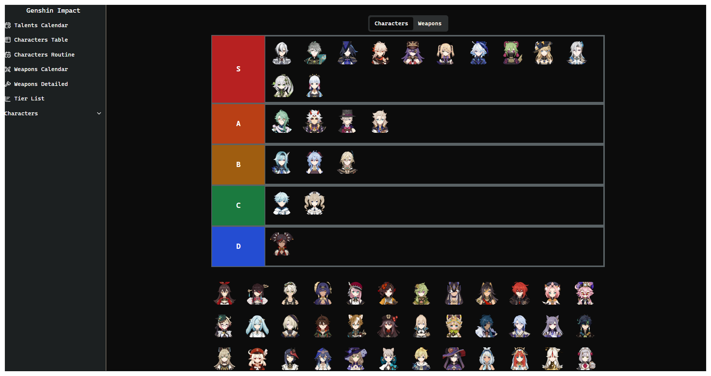

# GenshinQL

[](https://github.com/username/genshinql/actions/workflows/ci.yml)
[](https://github.com/username/genshinql/actions/workflows/codeql.yml)
[](https://opensource.org/licenses/MIT)

A comprehensive Genshin Impact information hub built with React, TypeScript, and Vite. Browse characters, weapons, talent schedules, build tier lists, and play the Genshindle guessing game!

## ✨ Features

- **Character Database** - Detailed information on all Genshin Impact characters
- **Weapon Catalog** - Complete weapon database with stats and ascension materials
- **Talent Schedule** - Daily talent book and weapon material farming calendar
- **Tier List Builder** - Create and customize your own tier lists
- **Genshindle** - A Wordle-style guessing game for Genshin characters
- **Responsive Design** - Works seamlessly on desktop and mobile

## 🚀 Quick Start

### Prerequisites

- **Node.js** 20 or higher
- **npm** (comes with Node.js)

### Installation

```bash
# Clone the repository
git clone https://github.com/username/genshinql.git
cd genshinql/client

# Install dependencies
npm install

# Start development server
npm run dev
```

The application will be available at [http://localhost:5173](http://localhost:5173)

## 🛠️ Technology Stack

### Core Technologies

- **[React 18](https://react.dev/)** - UI library
- **[TypeScript 5.6](https://www.typescriptlang.org/)** - Type-safe JavaScript
- **[Vite 5.4](https://vitejs.dev/)** - Fast build tool and dev server
- **[React Router v7](https://reactrouter.com/)** - Client-side routing

### State Management

- **[Zustand 5.0](https://zustand-demo.pmnd.rs/)** - Lightweight state management

### Styling

- **[Tailwind CSS 3.4](https://tailwindcss.com/)** - Utility-first CSS framework
- **[Radix UI](https://www.radix-ui.com/)** - Accessible component primitives
- **[shadcn/ui](https://ui.shadcn.com/)** - Beautiful, accessible components
- **[Framer Motion 11](https://www.framer.com/motion/)** - Animation library

### Infrastructure

- **[Cloudflare R2](https://www.cloudflare.com/products/r2/)** - Asset storage and CDN
- **[Vercel](https://vercel.com/)** - Deployment platform
- **[Selenium WebDriver](https://www.selenium.dev/)** - Web scraping for data collection

## 📚 Documentation

- **[Contributing Guide](./CONTRIBUTING.md)** - How to contribute to this project
- **[Development Guide](./DEVELOPMENT.md)** - Architecture and development patterns
- **[CI/CD Documentation](./CI_CD.md)** - Continuous integration and deployment

## 💻 Development

### Available Scripts

**Development:**
- `npm run dev` - Start development server
- `npm run build` - Build for production
- `npm run preview` - Preview production build

**Code Quality:**
- `npm run lint` - Run ESLint
- `npm run lint:fix` - Fix ESLint issues automatically
- `npm run format` - Format code with Prettier
- `npm run format:check` - Check code formatting
- `npm run validate` - Run lint + format + type check
- `npm run ci:check` - Run all CI checks locally

**Analysis:**
- `npm run build:analyze` - Analyze bundle size with visualizer

### Scraping Scripts

**Data Collection:**
- `npm run scrape:all` - Scrape all data (characters, weapons, talents, gallery)
- `npm run scrape:characters` - Scrape character data only
- `npm run scrape:weapons` - Scrape weapon data only
- `npm run scrape:talents` - Scrape talent schedules only
- `npm run scrape:gallery` - Scrape character gallery media only
- `npm run consolidate` - Consolidate scraped data into JSON files
- `npm run generate-primitives` - Generate game constants (elements, regions, etc.)

**Validation:**
- `npm run check-characters` - Validate character data completeness
- `npm run check-gallery` - Validate gallery media coverage

## 🤝 Contributing

We welcome contributions! Please see our [Contributing Guide](./CONTRIBUTING.md) for details.

### Quick Contribution Steps

1. Fork the repository
2. Create a feature branch (`git checkout -b feature/amazing-feature`)
3. Make your changes
4. Run `npm run ci:check` to validate
5. Commit with conventional commits (`feat: add amazing feature`)
6. Push to your fork (`git push origin feature/amazing-feature`)
7. Open a Pull Request

### Development Setup

```bash
# Install dependencies
npm install

# Install pre-commit hooks
npm run prepare
cd client
npx husky init

# Start coding!
npm run dev
```

## 📸 Screenshots

### Weapons Detailed


### Character Attacks


### Character Constellations


### Character Passives


### Character Routine


### Character Table


### Characters Talent Schedule


### Character Talents


### Weapon Calendar


### Character Tier List Builder


## 🔮 Future Additions

- Integrating with Enka Network for live player data
- Guides section for character builds and team compositions
- Artifacts, materials, and boss drops with detailed recommendations
- Advanced character build calculator
- Team composition optimizer

## 📝 License

This project is licensed under the MIT License - see the [LICENSE](./LICENSE) file for details.

## 🙏 Acknowledgments

- Genshin Impact game data from [Genshin Impact Wiki](https://genshin-impact.fandom.com/)
- Character and weapon icons from official Genshin Impact assets
- Community for feedback and contributions

---

Made with ❤️ for the Genshin Impact community
