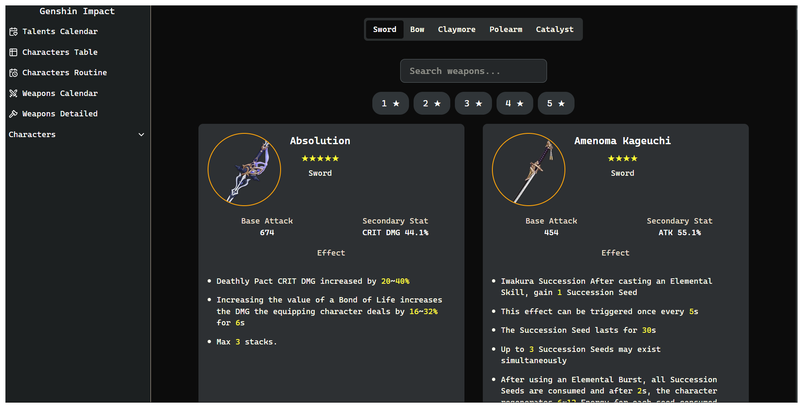
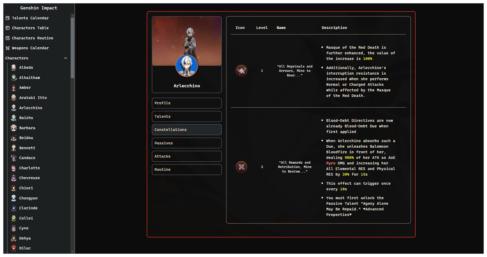
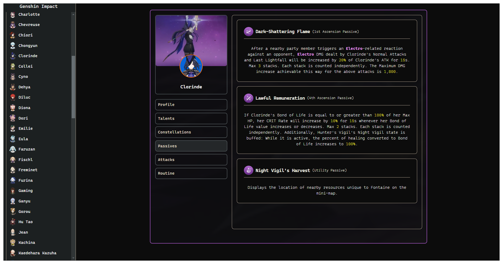
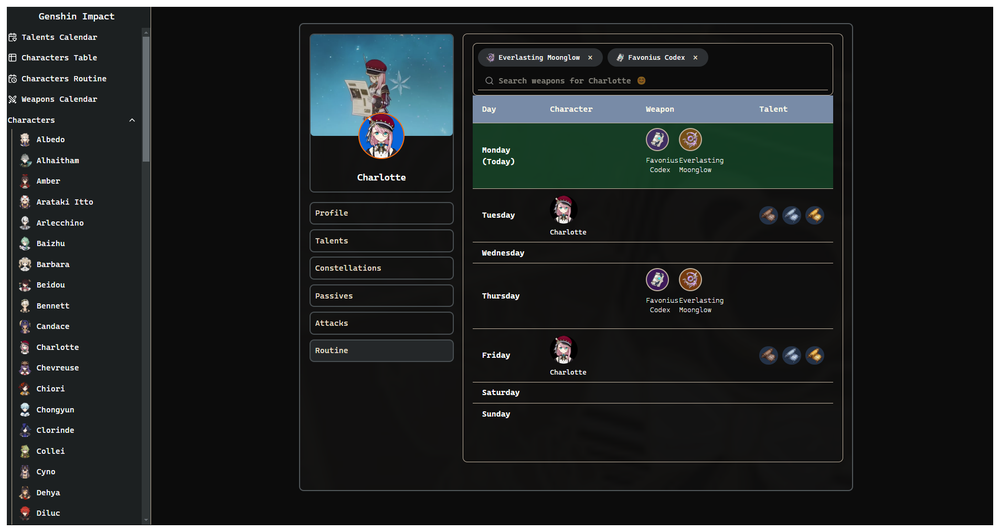
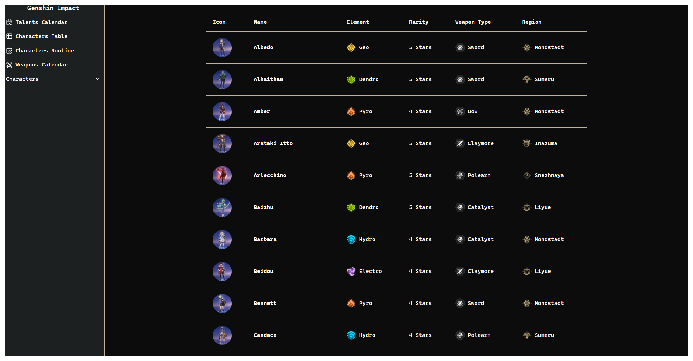
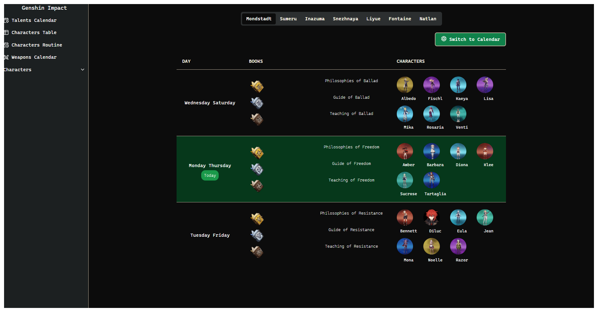
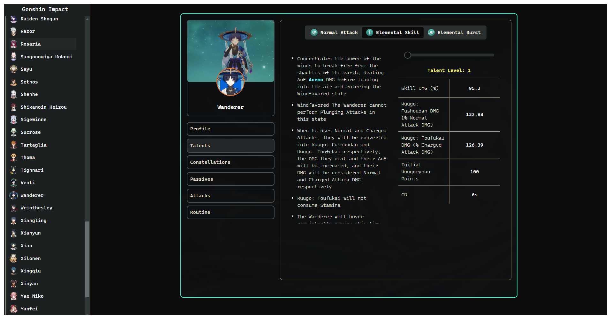
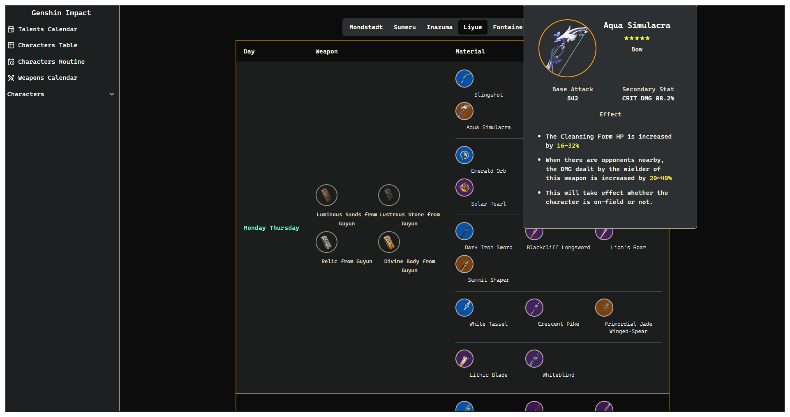

# Technology used

1. React Typescript and Tailwind css for the frontend
2. Typescript, Graphql, Sqlite for database also supabase for storing media

# ScreenShots

Here are some of the screenshots of this application

## Weapons Detailed

## Character Attacks

## Character Constellations

## Character  Passives

## Character Routine

## Character Table

## Characters Talent Schedule

## Character Talents

## Weapon Calender

# Future Additions
1. Integratring with Enka network
2. Adding functionality to store data in AWS s3
3. Adding sections for guides
4. Adding artifacts, materials, boss drops in more nuanced way for character building