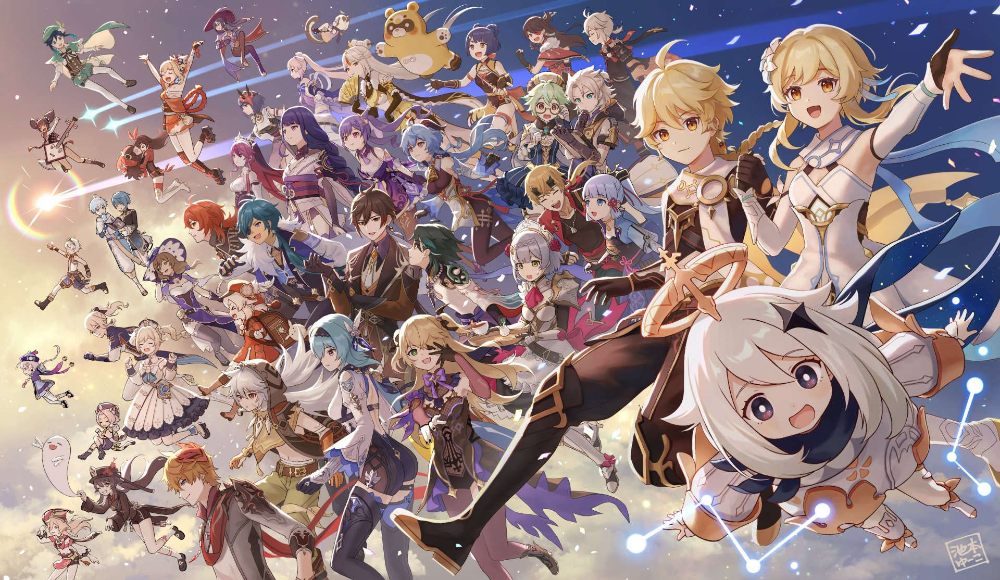
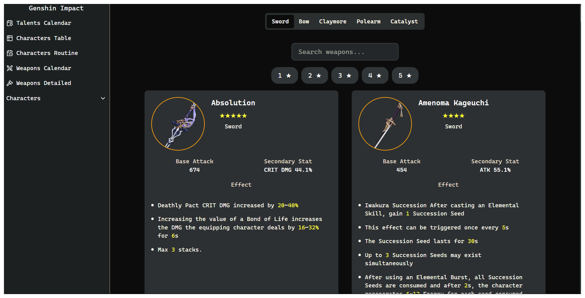
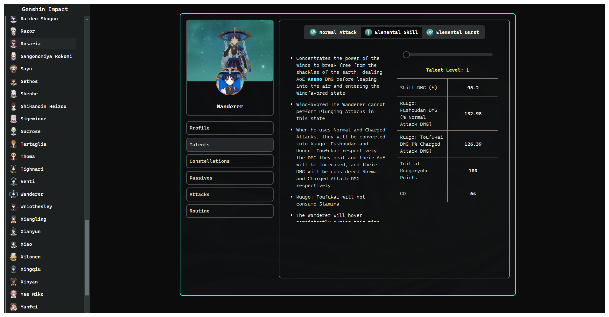
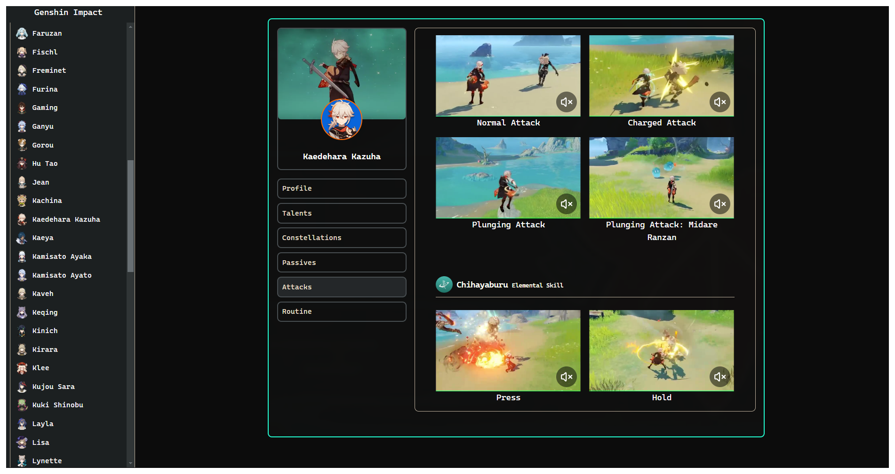
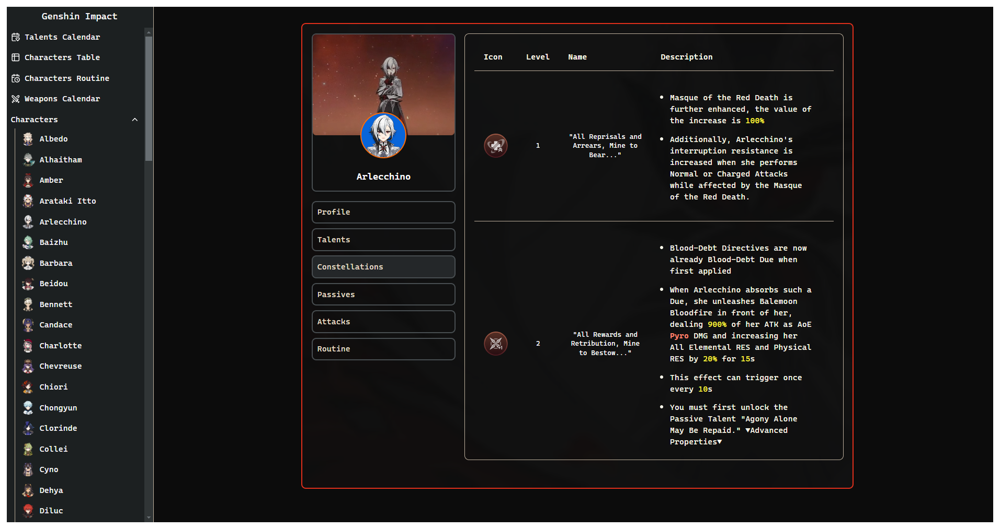
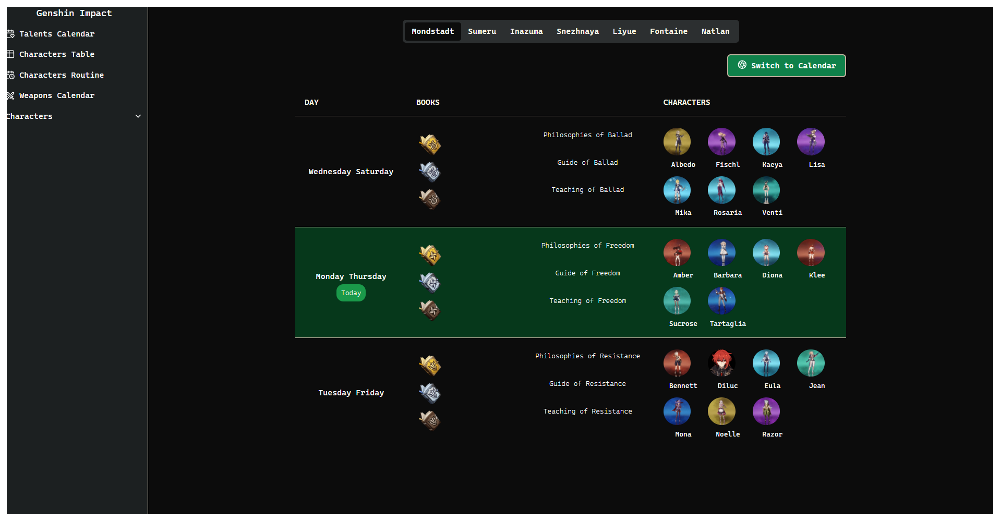
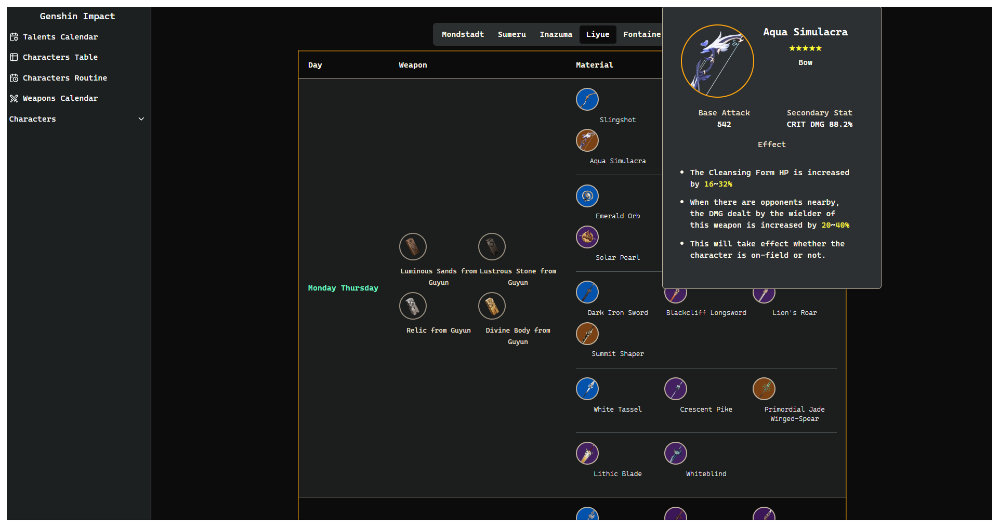
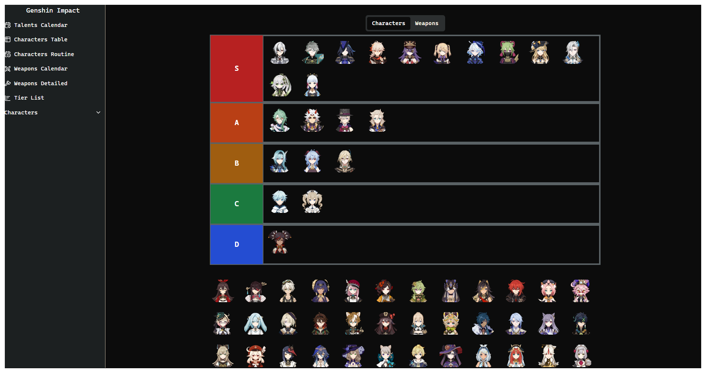
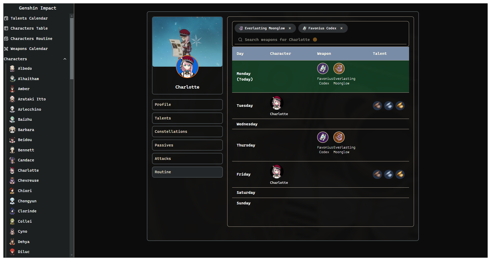

<div align="center">



<br />
<br />

# GenshinQL

**A comprehensive Genshin Impact hub** — browse characters & weapons, plan farming schedules,
<br />build tier lists, and challenge yourself with Genshin mini-games.

<br />

[](https://github.com/utkarsh5026/GenshinQL/actions/workflows/ci.yml)
[](https://github.com/utkarsh5026/GenshinQL/actions/workflows/codeql.yml)
[](https://opensource.org/licenses/MIT)


</div>

---

## ✨ Features

|     | Feature                | Description                                                            |
| :-: | :--------------------- | :--------------------------------------------------------------------- |
| 🧙  | **Character Database** | Full profiles — talents, constellations, passives, and ascension paths |
| ⚔️  | **Weapon Catalog**     | Complete stats, refinements, and material farming routes               |
| 📅  | **Farming Calendar**   | Daily talent-book and weapon-material schedule by day of week          |
| 🏆  | **Tier List Builder**  | Drag-and-drop tier list creator with shareable layouts                 |
| 🎮  | **Genshindle**         | Wordle-style character guessing game                                   |
| 🃏  | **Memory Game**        | Card-matching game with Genshin character art                          |
| 🔗  | **Linker Game**        | Connect characters by shared traits                                    |
| 📋  | **Routine Planner**    | Build and track your daily resin & farming routine                     |

---

## 🖼️ Screenshots

<table>
  <tr>
    <td align="center" width="50%">
      
      <br /><b>Weapon Detail</b>
    </td>
    <td align="center" width="50%">
      
      <br /><b>Character Talents</b>
    </td>
  </tr>
  <tr>
    <td align="center" width="50%">
      
      <br /><b>Character Attacks</b>
    </td>
    <td align="center" width="50%">
      
      <br /><b>Constellations</b>
    </td>
  </tr>
  <tr>
    <td align="center" width="50%">
      
      <br /><b>Talent Farming Calendar</b>
    </td>
    <td align="center" width="50%">
      
      <br /><b>Weapon Farming Calendar</b>
    </td>
  </tr>
  <tr>
    <td align="center" width="50%">
      
      <br /><b>Tier List Builder</b>
    </td>
    <td align="center" width="50%">
      
      <br /><b>Routine Planner</b>
    </td>
  </tr>
</table>

---

## 🚀 Quick Start

### Prerequisites

- **[Bun](https://bun.sh/)** — fast all-in-one JavaScript runtime & package manager

### Installation

```bash
# Clone the repo
git clone https://github.com/utkarsh5026/GenshinQL.git
cd GenshinQL/client

# Install dependencies
bun install

# Start dev server → http://localhost:5173
bun run dev
```

---

## 🛠️ Tech Stack

<table>
  <tr>
    <th>Layer</th>
    <th>Technology</th>
  </tr>
  <tr>
    <td><b>UI</b></td>
    <td>
      <a href="https://react.dev/">React 18</a> ·
      <a href="https://reactrouter.com/">React Router v7</a> ·
      <a href="https://www.framer.com/motion/">Framer Motion 12</a>
    </td>
  </tr>
  <tr>
    <td><b>Language</b></td>
    <td><a href="https://www.typescriptlang.org/">TypeScript 5.9</a> (strict mode)</td>
  </tr>
  <tr>
    <td><b>Build</b></td>
    <td><a href="https://vitejs.dev/">Vite 7</a> · <a href="https://bun.sh/">Bun</a></td>
  </tr>
  <tr>
    <td><b>State</b></td>
    <td><a href="https://zustand-demo.pmnd.rs/">Zustand 5</a></td>
  </tr>
  <tr>
    <td><b>Styling</b></td>
    <td>
      <a href="https://tailwindcss.com/">Tailwind CSS 4</a> ·
      <a href="https://ui.shadcn.com/">shadcn/ui</a> ·
      <a href="https://www.radix-ui.com/">Radix UI</a>
    </td>
  </tr>
  <tr>
    <td><b>Data</b></td>
    <td>Static JSON · IndexedDB (stale-while-revalidate cache) · <a href="https://www.selenium.dev/">Selenium</a> scrapers</td>
  </tr>
  <tr>
    <td><b>Infra</b></td>
    <td>
      <a href="https://www.cloudflare.com/products/r2/">Cloudflare R2</a> (media CDN) ·
      <a href="https://vercel.com/">Vercel</a> (hosting)
    </td>
  </tr>
</table>

> **No backend.** All data is served from static JSON files under `client/public/` and cached client-side in IndexedDB.

---

## 💻 Development

### Scripts

```bash
# Development
bun run dev           # Start Vite dev server (localhost:5173)
bun run build         # Type-check + production build
bun run preview       # Preview production build locally

# Code quality
bun run validate      # lint + format:check + tsc --noEmit  (run before pushing)
bun run lint:fix      # Auto-fix ESLint issues
bun run format        # Format code with Prettier

# Analysis
bun run build:analyze # Bundle size visualizer
```

### Data Scraping

```bash
bun run scrape:all          # Scrape all game data
bun run scrape:characters   # Characters only
bun run scrape:weapons      # Weapons only
bun run scrape:talents      # Talent schedules only
bun run scrape:gallery      # Character gallery media only
bun run consolidate         # Merge scraped data into JSON files
bun run generate-primitives # Regenerate game constants
```

---

## 🤝 Contributing

Contributions are welcome! Please check the [Development Guide](./DEVELOPMENT.md) for architecture details.

1. Fork the repository
2. Create a feature branch — `git checkout -b feat/amazing-feature`
3. Make your changes and run `bun run validate`
4. Commit using [Conventional Commits](https://www.conventionalcommits.org/) — `feat: add amazing feature`
5. Push and open a Pull Request

---

## 🔮 Roadmap

- [ ] Enka Network integration for live player data
- [ ] Character build guides and team composition recommendations
- [ ] Artifact, material, and boss-drop reference with build suggestions
- [ ] Advanced character build calculator
- [ ] Team composition optimizer

---

## 📝 License

Licensed under the [MIT License](./LICENSE).

---

<div align="center">

Made with ❤️ for the Genshin Impact community

[](https://github.com/utkarsh5026/GenshinQL)

</div>
